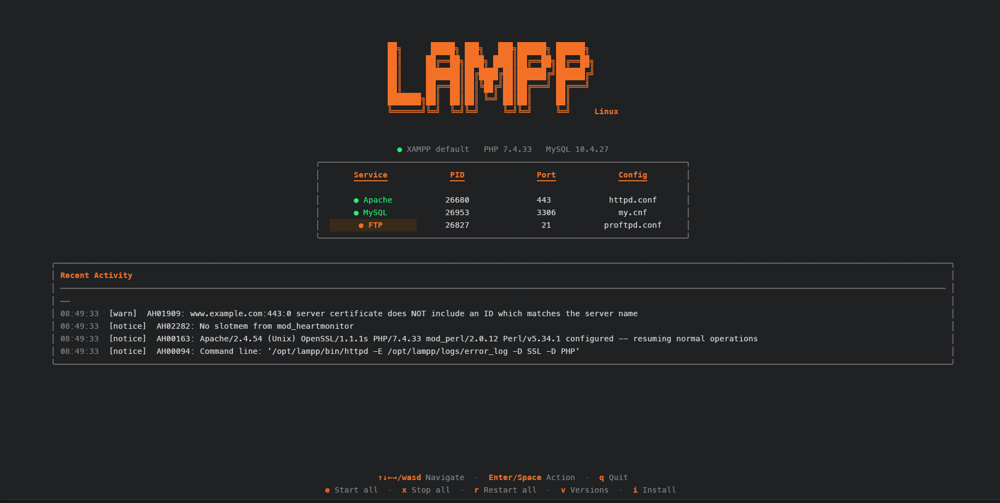
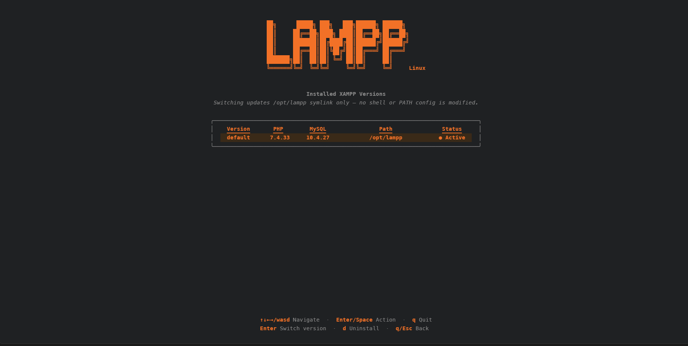
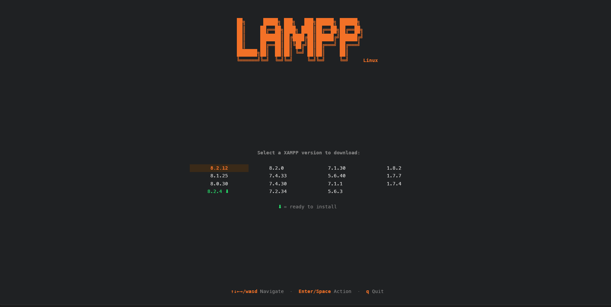

<div align="center">

<pre style="color:#ff7a1a; font-weight:bold; line-height:1;">
██╗      █████╗ ███╗   ███╗██████╗ ██████╗       ████████╗██╗   ██╗██╗
██║     ██╔══██╗████╗ ████║██╔══██╗██╔══██╗         ██╔══╝██║   ██║██║
██║     ███████║██╔████╔██║██████╔╝██████╔╝   ████  ██║   ██║   ██║██║
██║     ██╔══██║██║╚██╔╝██║██╔═══╝ ██╔═══╝          ██║   ██║   ██║██║
███████╗██║  ██║██║ ╚═╝ ██║██║     ██║              ██║   ╚██████╔╝██║
╚══════╝╚═╝  ╚═╝╚═╝     ╚═╝╚═╝     ╚═╝              ╚═╝    ╚═════╝ ╚═╝
</pre>

### 🖥️ A keyboard-driven terminal dashboard for XAMPP/LAMPP on Linux

<br/>

[](https://github.com/ramirezDg/lampp-tui/releases)
[](https://go.dev/)
[](https://kernel.org/)
[](LICENSE)
[](https://github.com/charmbracelet/bubbletea)
[](https://github.com/charmbracelet/lipgloss)

<br/>

> **Manage services · Install versions · Monitor your stack**
> — all without leaving the terminal.

<br/>



</div>

---

## ✨ Features

| | Feature | Description |
|---|---|---|
| ⚡ | **Service Control** | Start, stop, and restart Apache, MySQL, and FTP — individually or all at once |
| 📡 | **Live Status** | PID, listening port, and running state refreshed every **5 seconds** |
| 🌐 | **Open in Browser** | Press `Enter` on a port to open `http://localhost:{port}` directly |
| 🛠️ | **Edit Config** | Open `httpd.conf`, `my.cnf`, or `proftpd.conf` in `nano` without leaving the TUI |
| 💀 | **Kill Processes** | Send SIGTERM to any service process with a confirmation dialog |
| 📦 | **Multi-version XAMPP** | Install multiple XAMPP versions side by side under `/opt/xampp/{version}/` |
| 🔀 | **Version Switching** | Switch the active version by updating the `/opt/lampp` symlink |
| 🗑️ | **Version Uninstall** | Remove an installed version directly from the TUI |
| 🔧 | **Auto PATH Setup** | Adds `/opt/lampp/bin` to your shell config after installation |
| ℹ️ | **Version Info** | Shows PHP and MySQL version for each installed XAMPP |
| 🔄 | **Background Downloads** | Send downloads/installs to background with `q`/`Esc`, monitor progress in the corner |
| 📋 | **Activity Log** | Shows the last entries from Apache's error log |
| 🎨 | **Adaptive Theme** | Automatically adjusts to dark or light terminal backgrounds |

---

## 🖥️ Screenshots

<div align="center">

| Main Panel | Versions Panel | Downloads |
|:---:|:---:|:---:|
|  |  |  |

</div>

---

## 📋 Requirements

| Dependency | Purpose | Install |
|---|---|---|
| **Go 1.21+** | Build from source | [go.dev](https://go.dev/dl/) |
| **`sudo` access** | Control XAMPP services and manage `/opt/lampp` | — |
| **`gawk`** | Scrape XAMPP version list from SourceForge | `apt install gawk` |
| **`curl`** | Fetch version list and check for versions | `apt install curl` |
| **`xdg-open`** | Open URLs in the system browser | `apt install xdg-utils` |
| **`ss`** | Detect service ports (`iproute2` package) | `apt install iproute2` |
| **`nano`** | Edit configuration files | `apt install nano` |

<details>
<summary><b>📦 Install all dependencies at once</b></summary>

<br/>

**Debian / Ubuntu / Pop!_OS**
```bash
sudo apt install gawk curl iproute2 nano xdg-utils
```

**Arch / Manjaro**
```bash
sudo pacman -S gawk curl iproute2 nano xdg-utils
```

**Fedora**
```bash
sudo dnf install gawk curl iproute nano xdg-utils
```

</details>

---

## 🚀 Installation

> Choose the method that fits your workflow:

### ① Build from Source ⭐ Recommended

```bash
git clone https://github.com/ramirezDg/lampp-tui.git
cd lampp-tui
make install
```

> Compiles an optimised binary and copies it to `/usr/local/bin/xampp-tui`.

---

### ② Download a Pre-built Release

```bash
# Download the latest release from the Releases page, then:
tar xzf xampp-tui-linux-amd64.tar.gz
sudo install -m 755 xampp-tui /usr/local/bin/
```

---

### ③ Run Without Installing

```bash
git clone https://github.com/ramirezDg/lampp-tui.git
cd lampp-tui
go mod tidy
go run ./cmd/lampp-tui
```

---

### ④ Quick build (single binary)

```bash
git clone https://github.com/ramirezDg/lampp-tui.git
cd lampp-tui
go build -o lampp-tui && ./lampp-tui
```

---

## 🎮 Usage

```bash
xampp-tui             # launch the TUI
xampp-tui --version   # print version and exit
```

> If XAMPP is not installed, the tool will guide you through downloading and installing it.

---

## ⌨️ Keyboard Shortcuts

### 🗂️ Main Panel

| Key | Action |
|:---:|---|
| `↑` `↓` `←` `→` / `w` `a` `s` `d` | Navigate the service table |
| `Enter` / `Space` | Execute action for the selected cell |
| `e` | ▶️ Start all services |
| `x` | ⏹️ Stop all services |
| `r` | 🔄 Restart all services |
| `v` | 📦 Open installed versions panel |
| `i` | ⬇️ Install a new XAMPP version |
| `q` / `Ctrl+C` | 🚪 Quit |

### 🎯 Cell Actions — press `Enter` on each column

| Column | Action |
|:---:|---|
| **Service** | Toggle start / stop |
| **PID** | Confirmation dialog → kill process (SIGTERM) |
| **Port** | Open `http://localhost:{port}` in browser + show URL modal |
| **Config** | Confirmation dialog → open config file in `nano` |

### 📥 Download / Install Screens

| Key | Action |
|:---:|---|
| `q` / `Esc` | Send to background (continues running) |
| `Ctrl+C` | Quit the application |

> 💡 A small `⟳ DL 67%` or `⟳ Installing…` indicator appears in the bottom-right corner when a task is running in the background.

### 📦 Versions Panel — press `v`

| Key | Action |
|:---:|---|
| `↑` `↓` | Navigate installed versions |
| `Enter` | Switch to selected version (confirmation required) |
| `d` | Uninstall selected version (confirmation required) |
| `q` / `Esc` | Back to main panel |

> ⚠️ **Note:** The active version cannot be switched to itself or uninstalled. Switch to a different version first.

---

## 📦 Multi-version XAMPP

xampp-tui supports installing and running multiple XAMPP versions side by side.

### How it works

Each version is installed to its own directory:

```
/opt/xampp/
├── 8.2.12/    ←  XAMPP 8.2.12  (PHP 8.2 · MySQL 8.0)
└── 8.1.6/     ←  XAMPP 8.1.6   (PHP 8.1 · MySQL 5.7)
```

The **active version** is determined by the `/opt/lampp` symlink:

```
/opt/lampp  ──►  /opt/xampp/8.2.12/
```

> Switching versions updates **only** this symlink — no other files are modified.

---

### 🔽 Installing a new version

```
1. Press  i  from the main panel
2. Select a version from the grid (fetched from SourceForge)
   └─ Versions marked with ⬇ are already downloaded and ready to install
3. Confirm the download (or press Install Now if already downloaded)
4. When complete, choose  Install Now  or  Skip
5. The installer runs unattended; /opt/lampp is updated automatically
```

### 🔀 Switching versions

```
1. Press  v  from the main panel
2. Navigate to the desired version
3. Press  Enter  and confirm
4. Stop current services and restart them with the new version
```

### 🗑️ Uninstalling a version

```
1. Press  v  from the main panel
2. Navigate to the version to remove
3. Press  d  and confirm
4. /opt/xampp/{version}/ is permanently deleted
```

### 🔧 PATH Setup

After a successful installation, xampp-tui automatically adds `/opt/lampp/bin` to your shell startup file (`~/.zshrc`, `~/.bashrc`, or `~/.profile`).

Apply the change in your current session:

```bash
source ~/.zshrc   # or ~/.bashrc
```

---

## 🗺️ Project Structure

```
xampp-tui/
│
├── 📂 cmd/lampp-tui/
│   └── main.go                  # Entry point (--version flag)
│
├── 📂 internal/
│   ├── 📂 tui/
│   │   ├── model.go             # Application state (Bubble Tea Model)
│   │   ├── update.go            # Event handling and keyboard input
│   │   ├── view.go              # Screen routing and layout
│   │   ├── render.go            # Component rendering
│   │   └── styles.go            # Adaptive colour palette
│   │
│   ├── 📂 xampp/
│   │   ├── service.go           # Service control and status (start/stop/PID/port)
│   │   ├── multiver.go          # Multi-version scanning, switching, and uninstall
│   │   ├── shell.go             # Shell config detection and PATH setup
│   │   ├── logs.go              # Apache error log parser
│   │   └── validator.go         # XAMPP installation detection
│   │
│   ├── 📂 installer/
│   │   ├── downloader.go        # HTTP download with progress callback and validation
│   │   ├── runner.go            # BitRock .run installer execution
│   │   └── versions.go          # SourceForge version scraper
│   │
│   └── 📂 logger/
│       └── logger.go            # Append-only file logger (XDG-compliant path)
│
├── Makefile
└── install.sh
```

---

## 🔨 Building

```bash
make build      # Development build
make release    # Optimised release binary (stripped, no debug info)
make install    # Install to /usr/local/bin
make clean      # Clean build artefacts
```

---

## 📁 File Locations

| Path | Purpose |
|---|---|
| `~/.local/share/xampp-tui/downloads/` | Downloaded XAMPP installers |
| `~/.local/share/xampp-tui/logs/` | Application log |
| `/opt/xampp/{version}/` | Installed XAMPP versions |
| `/opt/lampp` | Symlink to the active XAMPP version |

---

## 🔐 Sudo Configuration

xampp-tui uses `sudo` to control XAMPP services and manage the `/opt/lampp` symlink.

To avoid password prompts, add a sudoers rule:

```bash
sudo visudo
```

Add the following line (replace `youruser` with your actual username):

```
youruser ALL=(ALL) NOPASSWD: /opt/lampp/lampp, /bin/ln, /usr/bin/ln, /bin/rm, /usr/bin/rm
```

---

## 🤝 Contributing

Contributions, issues and feature requests are welcome!

Please use descriptive branches:

```
feat/new-feature
fix/service-bug
refactor/tui-layout
```
---

## 📄 License

This project is licensed under the **MIT License** — see the [LICENSE](LICENSE) file for details.

---

<div align="center">

Made with 🖤 and Go · [@ramirezDg](https://github.com/ramirezDg)

[](https://github.com/ramirezDg/lampp-tui)

</div>
