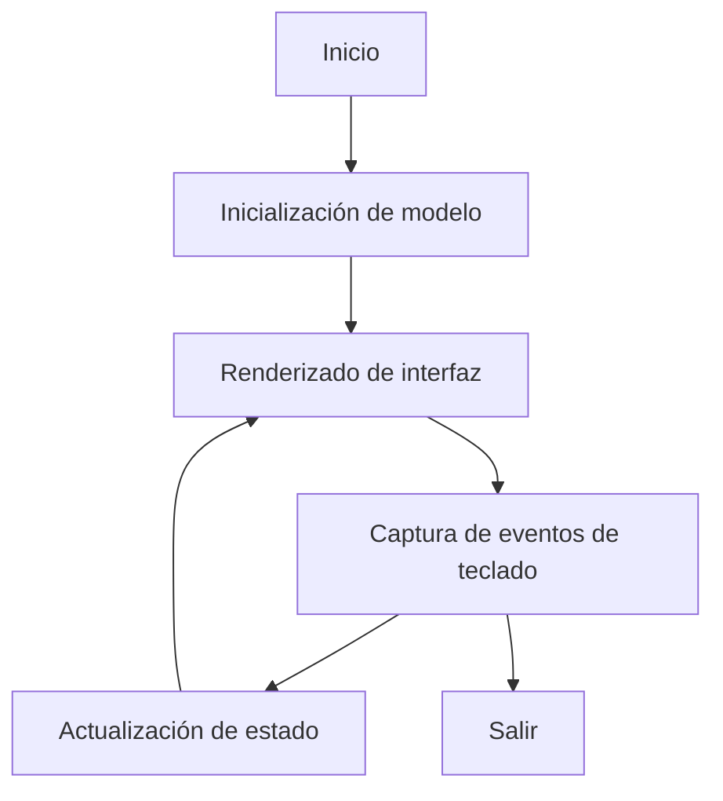

# Documentación avanzada

## Arquitectura del Proyecto

El proyecto **xampp-tui** está diseñado bajo una arquitectura modular y sencilla para facilitar su mantenimiento y extensión. Los principales componentes son:

- **main.go**: Punto de entrada, contiene la lógica principal de la TUI, el ciclo de eventos y la inicialización del modelo.
- **ui.go**: Funciones auxiliares para el renderizado visual, estilos y helpers para la interfaz.
- **docs/**: Documentación técnica y de usuario.
- **internal/** (opcional): Código reutilizable o módulos internos.
- **assets/** (opcional): Recursos estáticos como imágenes o ejemplos de configuración.

### Diagrama de flujo simplificado



## Instalación avanzada

1. Clona el repositorio y entra en la carpeta:
	```bash
	git clone https://github.com/ramirezDg/lampp-tui.git
	cd lampp-tui
	```
2. Instala las dependencias:
	```bash
	go mod tidy
	```
3. Compila el binario:
	```bash
	go build -o xampp-tui main.go ui.go
	```
4. Ejecuta el binario:
	```bash
	./xampp-tui
	```

### Instalación global (opcional)

Puedes mover el binario a `/usr/local/bin` para ejecutarlo desde cualquier lugar:
```bash
sudo mv xampp-tui /usr/local/bin/
```

## Guía de desarrollo

### Estructura recomendada

```
lampp-tui/
├── main.go
├── ui.go
├── go.mod / go.sum
├── README.md
├── docs/
├── internal/   # (opcional)
└── assets/     # (opcional)
```

### Buenas prácticas

- Usa ramas para nuevas características o correcciones.
- Escribe mensajes de commit claros y descriptivos.
- Documenta funciones y módulos importantes.
- Usa etiquetas Git para versionado semántico.

### Ejecución de pruebas (si agregas tests)

```bash
go test ./...
```

## Preguntas frecuentes (FAQ)

**¿Puedo agregar más servicios?**
Sí, edita la función `initialModel()` en `main.go` para añadir o quitar servicios.

**¿Funciona en Windows o Mac?**
El desarrollo y pruebas se han realizado en Linux. Puede funcionar en otros sistemas, pero puede requerir ajustes.

**¿Cómo cambio los puertos o configuraciones?**
Modifica los valores iniciales en el modelo de servicios en `main.go`.

**¿Puedo personalizar los atajos de teclado?**
Actualmente los atajos están definidos en el código fuente. Puedes modificarlos editando el manejo de eventos en `main.go`.

**¿Dónde reporto bugs o solicito mejoras?**
Abre un issue en el repositorio de GitHub: https://github.com/ramirezDg/lampp-tui/issues